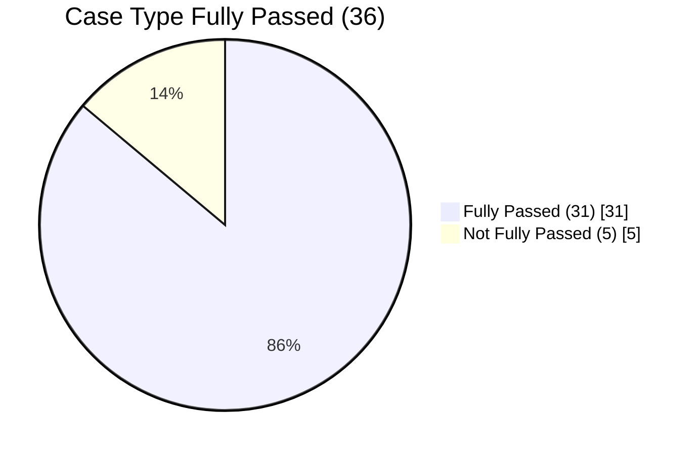
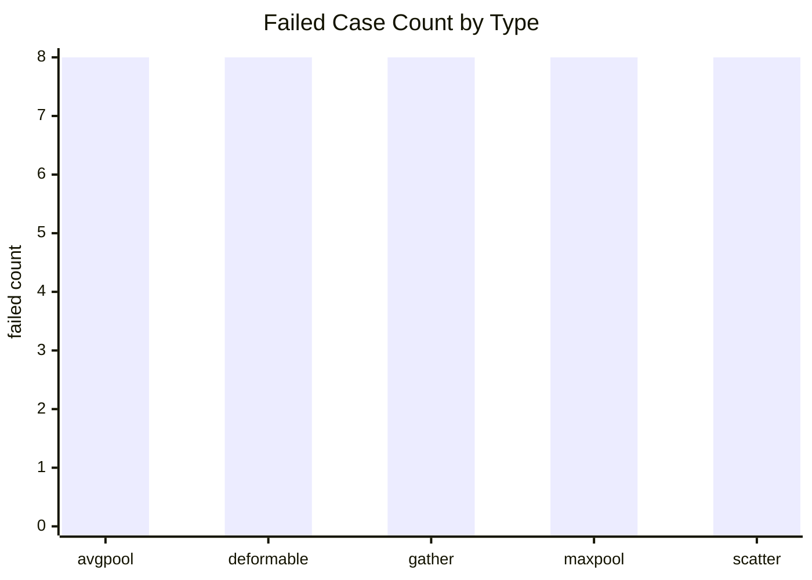

# cu2asc xpiler 运行失败分析报告（20260310_023336）

## 1. 执行总览（可直接用于 PPT）

数据来源：`gpt_5_xpiler.log`（33305-34123）

### 1.1 总体指标

| 指标 | 数值 | 备注 |
|---|---:|---|
| 总 case 数 | 288 | 36 个 case type × 8 个样例 |
| 成功 case 数 | 248 | 日志给出的 overall total |
| 失败 case 数 | 40 | 288 - 248 |
| 个体 case 成功率 | **86.11%** | 248 / 288 |
| 全通过 case type 数 | 31 | 日志给出的 case type fully passed |
| 失败 case type 数 | 5 | 36 - 31 |
| case type 全通过率 | **86.11%** | 31 / 36 |
| case_total | 679,461.473 ms | 全流程累计耗时 |
| llm_call | 62,616.153 ms | LLM 调用累计耗时 |
| LLM 耗时占比 | **9.22%** | llm_call / case_total |

### 1.2 通过/失败结构图

```mermaid
pie showData
    title Individual Case Result (288)
    "Success (248)" : 248
    "Failed (40)" : 40
```

### 1.3 失败类型分布（Top）

| case type | 成功/总数 | 成功率 | 重试表现 |
|---|---:|---:|---|
| avgpool | 0/8 | 0% | 8 个样例均重试 5 次，最终失败（Round 5） |
| deformable | 0/8 | 0% | 8 个样例均重试 5 次，最终失败（Round 5） |
| gather | 0/8 | 0% | 8 个样例均重试 5 次，最终失败（Round 5） |
| maxpool | 0/8 | 0% | 8 个样例均重试 5 次，最终失败（Round 5） |
| scatter | 0/8 | 0% | 8 个样例均重试 5 次，最终失败（Round 5） |

### 1.4 第几次正确（Attempt/Round 聚合）

从该区间日志可见：

- 成功样例：均为 **Attempt 1, Round 1** 即一次通过。
- 失败样例：均经历 **Attempt 1~5 到 Round 5**，仍失败。

| 聚合维度 | 数量 | 占比 |
|---|---:|---:|
| 首次通过（Attempt1/Round1） | 248 | 86.11% |
| 重试后通过（Attempt>1） | 0 | 0% |
| 5 轮后仍失败 | 40 | 13.89% |

结论：当前重试机制几乎未带来收益，失败更像是“模板/算子实现级系统性问题”，而不是偶发生成偏差。

---

## 2. 重点 case 说明：`transpose_42_36_55`

`transpose_42_36_55` 在日志中记录为：

- 状态：✅ 成功
- 通过时机：**Attempt 1, Round 1**

定位意义：

- 该 case 可作为“**复杂形状但规则变换可稳定通过**”的正例基线。
- 对比失败族（pool/gather/scatter/deformable），说明当前框架在“纯维度重排/线性代数类”任务稳定性更高；在“索引/窗口/几何采样类”任务存在结构性短板。

---

## 3. 失败原因分析（根因假设）

> 注：以下基于日志统计模式进行根因分层；要做到代码级定责，建议补充每个失败样例的编译报错与数值对比日志。

### 3.1 一级结论：失败是“算子簇”级系统性失败

证据：

- 5 个失败 type 全部是 0/8，且每个样例都失败到 Round 5。
- 其余 31 个 type 全部 8/8，且几乎全是首轮通过。

这类“两极分化”通常意味着：

- 不是 prompt 波动；
- 不是单个 shape corner case；
- 而是特定算子模板/lowering 规则在全域不可用。

### 3.2 二级结论：按语义分组的风险点

1) Pooling 族（`avgpool`、`maxpool`）  

- 可能问题：
  - padding/stride/kernel 映射规则错误（边界 off-by-one）；
  - NHWC/NCHW 维度约定不一致；
  - 对齐策略（ceil/floor）与参考实现不一致；
  - reduce 初始值或类型提升规则错误（尤其 max 的最小值初始化）。

2) 索引写回族（`gather`、`scatter`）  

- 可能问题：
  - index dtype（int32/int64）或越界裁剪策略不一致；
  - 轴语义（axis/batch_dims）映射错误；
  - `scatter` 的写冲突策略（覆盖/累加/未定义）与目标后端不一致；
  - 广播与 shape 推导规则漏处理。

3) 几何采样族（`deformable`）  

- 可能问题：
  - 双线性插值、坐标归一化、边界处理（zero/border/reflection）不一致；
  - offset/mask 布局解释错误；
  - 分组维度（group/deformable_group）映射错误；
  - 精度和顺序差异导致误差超阈值。

### 3.3 重试无收益的机制原因

- 当前多轮尝试没有引入“新增诊断信号”，导致同类错误反复生成；
- 缺少按算子族定制的纠错指令（generic retry -> generic failure）；
- 缺少“失败后快速切换到保守模板”的兜底路径。

---

## 4. 改进方案（按优先级）

### P0：一周内可落地（先止血）

1. 建立“算子族兜底模板”  

- 对 `avgpool/maxpool/gather/scatter/deformable` 增加 hand-crafted fallback lowering；
- 触发条件：首轮失败即切 fallback，不再盲目多轮自由生成。

2. 在重试链路注入结构化错误上下文  

- 将编译错误、shape 对比、关键中间张量统计（min/max/NaN）回灌下一轮 prompt；
- 禁止“无新信息重试”。

3. 增加最小诊断断言  

- 每个失败族新增 2~3 个 smoke case（边界 shape + 特殊参数）；
- 失败时输出标准化差异报告（axis、stride、padding、dtype、误差）。

### P1：两到四周（提通过率）

1. 构建“算子语义契约测试”  

- 针对 pool/gather/scatter/deformable 提炼 reference contract；
- 每次模板改动先过 contract 再进 batch。

2. 做策略化重试而非次数化重试  

- Round 1：常规模板；
- Round 2：保守模板（显式边界处理）；
- Round 3：降级实现（性能差但保证正确）；
- 超过 Round 3 直接 fail-fast，节省时间。

3. 建立失败聚类与自动归因  

- 按错误码/报错关键字/输出模式聚类；
- 自动映射到“轴语义问题、边界问题、dtype 问题”等根因标签。

### P2：中期优化（提效率）

1. 运行预算重分配  

- 当前无效重试较多；建议将失败族重试上限从 5 降至 3，并把节省预算投入诊断日志采集。

2. 质量门控  

- 若某 case type 连续 N 次 batch 全 0/8，自动触发“模板冻结+专项修复”流程，避免重复消耗。

---

## 5. 可汇报的结论话术（PPT 可直接复用）

- 本轮整体个体通过率 **86.11%（248/288）**，31/36 类型全通过。  
- 失败集中在 5 个算子族，且全部是 **0/8 + Round5 仍失败**，属于系统性问题而非随机波动。  
- 成功样例几乎全部 **Attempt1/Round1**，说明主干能力稳定。  
- 下一步策略是“**算子族兜底模板 + 结构化诊断重试 + 契约测试**”，目标先把失败族从 0% 拉升到可用区间。

---

## 6. 后续需要补充的数据（用于下一版精细报告）

为给出代码级根因和更精确修复建议，建议补齐：

1. 5 个失败 type 的每个样例错误日志（编译错误/运行错误/校验误差）；  
2. 每轮生成代码 diff（Attempt 间变化）；  
3. 关键输入输出摘要（shape、dtype、统计量）；  
4. 误差阈值与判定规则（绝对/相对误差、容差）。

补齐后可输出“失败根因-修复动作-预期收益”一一映射表（工程执行版）。
